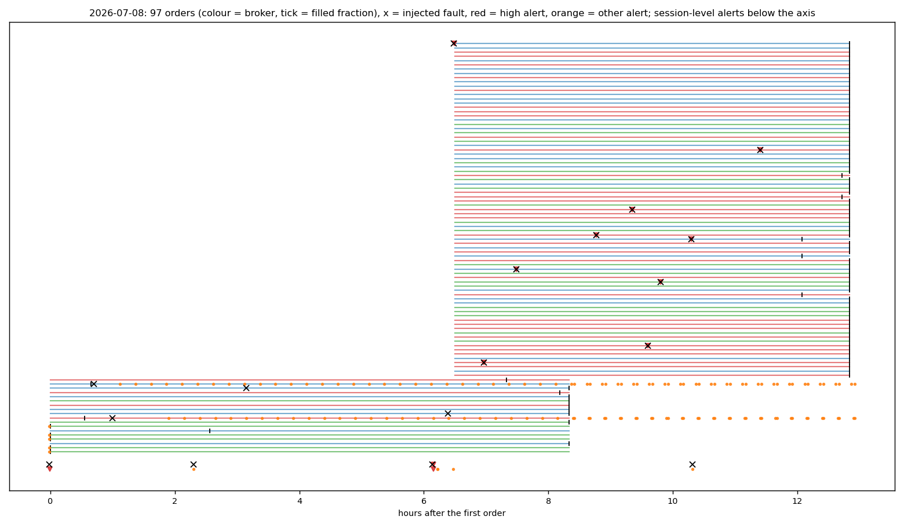
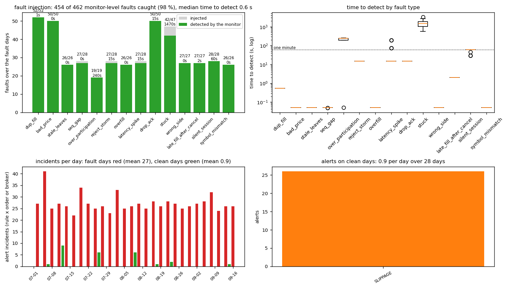
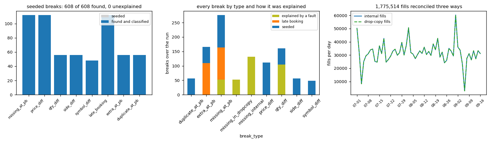
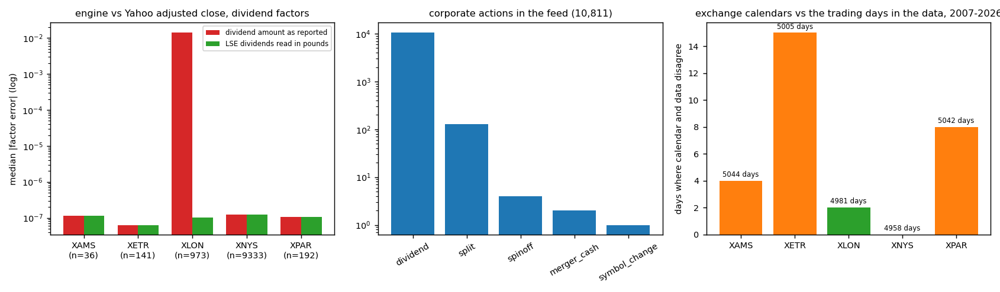
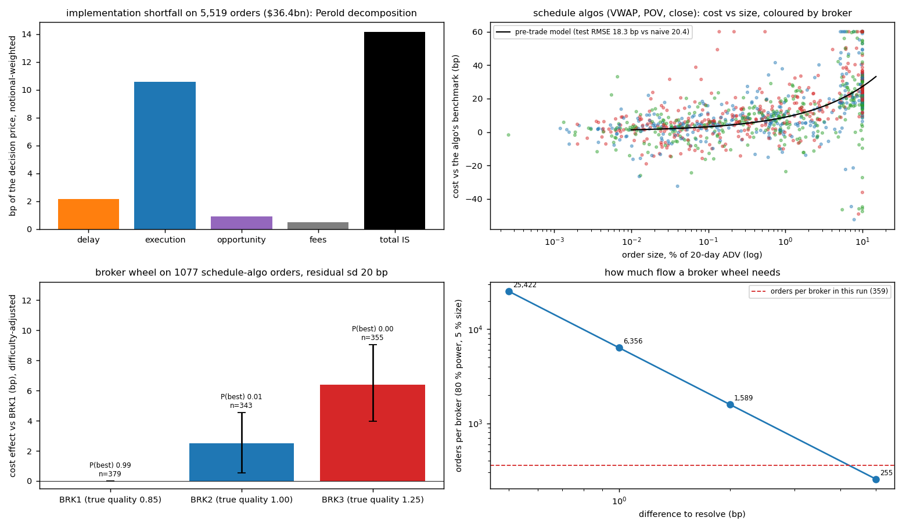
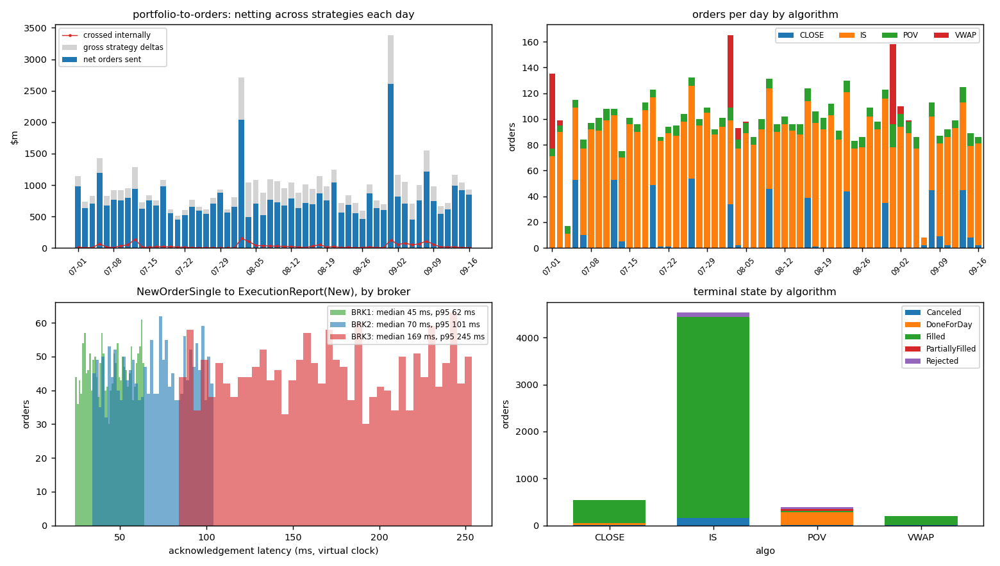
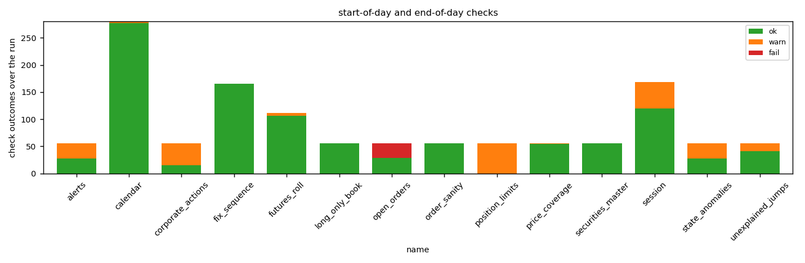

# execution-ops — portfolio-to-orders, FIX order lifecycle, live monitor, reconciliation, corporate actions

**Question.** A systematic multi-asset fund sends a hundred-odd orders a day through brokers' algorithms. What has to be checked before, during and after the day for the book to be right, how quickly can a monitor catch what goes wrong, and what does the execution cost? This is the operations stack that answers with measured numbers rather than a description: a fault-injection harness for the live monitor, a scored three-way reconciliation, a corporate-actions engine checked against twenty years of vendor data, exchange and contract calendars checked against the data, and transaction-cost analysis with a broker wheel.

**Answer (§Results).**
- *Order flow monitoring.* Over 28 fault days, 454 of 462 faults injected into the brokers and the transport (dropped acknowledgements, stuck algos, duplicate and wrong-side fills, off-market prices, runaway participation, reject storms, silent sessions, lost messages, latency spikes, stale leaves, overfills, fills after cancel) were caught, median time to detect 0.6 s; on the 28 clean days in between the monitor raised 0.9 alerts a day. The two faults that are not the monitor's job (a fill missing from the drop copy) were all found by the end-of-day reconciliation.
- *Reconciliation.* 1,775,514 fills reconciled three ways (blotter, broker drop copy, prime-broker file) and against positions in SQL: 608 of 608 seeded breaks found and classified, 0 unexplained; every break a fault caused is labelled with the fault.
- *Corporate actions.* The engine reproduces Yahoo's own dividend adjustment for 10,672 of 10,675 dividends (median relative error 1.2·10⁻⁷) once one vendor inconsistency is corrected: for London names Yahoo adjusts pence prices with the dividend read in pounds, a factor of 100, which the check finds on all 973 LSE dividends. Splits, spin-offs, cash mergers and renames are applied to positions and open orders with cash in lieu.
- *Calendars.* The NYSE calendar written here matches the 4,958 trading days in the data from 2007 to 2026 exactly, including the Sandy, Bush and Carter closures; the LSE calendar matches 4,981 days with two vendor discrepancies; futures first-notice and last-trading days, IMM and CDX rolls, option expiries, SIFMA TBA classes and the TIPS reference CPI are checked against published dates.
- *Execution cost.* 5,519 executed orders (\$36.4bn): implementation shortfall 14.1 bp of the decision price, decomposed exactly into delay 2.2, execution 10.6, opportunity 0.9 and fees 0.5. The broker wheel, on the schedule-algo orders against each algo's own benchmark, ranks the three simulated brokers in their true quality order with intervals that exclude zero (BRK3 costs 6.4 bp more than BRK1, CI [+4.0, +9.1]); on all orders against a single VWAP benchmark it cannot, and the power analysis says why (1,589 orders per broker to resolve 2 bp). A square-root pre-trade model fitted on the first two thirds of the days predicts the last third with RMSE 18.3 bp against 20.4 for the mean, correlation 0.45.

Python package `xops` with its own FIX 4.4 engine (no QuickFIX wheel exists for this Python), DuckDB store, systemd deploy files and a runbook. 26 tests (FIX framing on hand-checked messages, session recovery, the order state machine under random report streams, calendars against published dates, corporate actions on positions, the reconciliation on a seeded day, the TCA identity, one engine day on the committed data) plus the socket self-test; CI runs all of it, the calendar and corporate-action checks, and a four-day pipeline on the committed data.

---

## Layout

| path | what |
|---|---|
| `xops/fix/` | FIX 4.4: `message.py` (tag=value, BodyLength, CheckSum, framing), `session.py` (Logon/Logout, Heartbeat/TestRequest, sequence numbers, ResendRequest, gap fill, PossDup, SequenceReset, persistence, re-logon), `transport.py` (TCP with a reader thread; an in-process link on a virtual clock with drop / duplicate / delay / silence faults), `orders.py` (D, G, F, 8, 9 builders and the ExecutionReport view), `state.py` (the buy-side order state machine: explicit transition table, invariants, anomalies, cancel/replace chains) |
| `xops/calendar.py`, `xops/fi.py` | NYSE, LSE, Xetra, Euronext and CME calendars with early closes and one-off closures; CME futures first-notice and last-trading rules (ZT/ZF/ZN/TN/ZB/UB, SR1/SR3, ES/NQ, 6E, GC, CL, NG), IMM dates, CDX rolls, option expiries, SIFMA TBA classes, TIPS reference CPI and index ratio, roll checks |
| `xops/data.py`, `tools/download.py` | universe (156 US, 20 LSE, 14 continental names), 20 years of daily bars with dividends and splits from the Yahoo chart API (committed as parquet), curated spin-offs / mergers / renames, BLS CPI-U, the SIFMA TBA calendar; the DuckDB schema |
| `xops/corpact.py` | adjustment factors, application to positions (cash in lieu, receivables, renames, cash mergers) and to open orders, the validation against Yahoo's adjusted close |
| `xops/strategies.py`, `xops/portfolio.py` | three simple strategies (12-1 momentum monthly, 5-day reversal daily, inverse-volatility weekly) on \$2bn; targets to orders: netting across strategies with internal crossing, lot rounding, minimum notional, restricted list, short locates, ADV caps with carry-over, algo choice by size and urgency, session times per exchange, randomised broker assignment |
| `xops/market.py`, `xops/broker.py` | reduced-form intraday market (Brownian bridge from the real open to the real close, U-shaped real volume, spread rule, square-root temporary and permanent impact, fill caps per minute); the simulated broker behind a FIX acceptor: validation and rejects, VWAP / TWAP / POV / IS / CLOSE algos, cancel and replace, done-for-day, drop copy, and the fault hooks |
| `xops/monitor.py`, `xops/faults.py` | the live monitor (order state machines, per-broker sessions, seventeen rules with thresholds and cooldowns) and the fault catalogue, schedule generator and scorer |
| `xops/engine.py`, `xops/run.py` | the day runner on a virtual clock (event-driven delivery inside each minute, timers every 15 s), the multi-day pipeline alternating fault and clean days, the store writes and results JSON |
| `xops/recon.py`, `xops/checks.py`, `xops/tca.py` | three-way reconciliation in SQL with the break taxonomy and the seeded prime-broker file; start-of-day and end-of-day checks; TCA (Perold decomposition, benchmarks, wheel with bootstrap and power, pre-trade model) |
| `xops/serve.py`, `xops/cli.py` | the acceptor on real sockets and the socket self-test; `python -m xops build-store | calendar-check | corpact-check | fi-check | run | sod | recon | tca | serve | selftest` |
| `deploy/` | systemd services and timers for the London-morning SOD, the trading day and the EOD, and `RUNBOOK.md` (every alert and break, what it means, what to do, when to escalate) |
| `tests/`, `.github/workflows/ci.yml` | pytest and CI |
| `scripts/run_all.sh`, `plots.py`, `summarize.py`, `report.py` | pipeline, figures, `results/summary.md`, `report.pdf`; `notebooks/results.ipynb` |

Run: `pip install numpy pandas pyarrow duckdb matplotlib fpdf2 pytest`, then `scripts/run_all.sh --skip-download` (the derived data is committed; the full window takes about fifteen minutes) or `--quick` for four days. Linux: copy `deploy/*.service` and `*.timer` to `/etc/systemd/system`, adjust the paths, `systemctl enable --now xops-sod.timer xops-day.timer xops-eod.timer`.

---

## Data

| layer | source | notes |
|---|---|---|
| daily bars, dividends, splits | Yahoo chart API, 20 years, 190 names on five exchanges (`data/derived/prices.parquet`, `events_yahoo.csv`) | free, no key; Yahoo's close is already split-adjusted and its adjusted close adds dividends, which fixes what can be checked (§Corporate actions); LSE prices in pence |
| spin-offs, cash mergers, renames | `data/reference/corporate_actions_curated.csv` | GE → GEHC (1:3, 2023-01-04) and GEV (1:4, 2024-04-02), MMM → SOLV (1:4), T → WBD (0.241917, approximate ex-date), ATVI (\$95 cash), TWTR (\$54.20 cash), FB → META (2022-06-09); Yahoo does not carry these |
| TBA notification and settlement dates | SIFMA, classes A–D, 2026–2027 | parsed from the published table |
| CPI-U (NSA) | BLS API, 2024–2026 | for the TIPS reference CPI |
| order flow | generated by the three strategies from the daily data | realistic sizes and timing (the rebalances of a \$2bn book: about 100 orders a day, 0.01 % to 10 % of ADV) without any client model |
| brokers, fills, prime broker | simulated | three brokers with impact multipliers 0.85 / 1.00 / 1.25 and different latency; the prime-broker file is the drop copy with seeded breaks |

---

## Method

**Portfolio to orders.** Each strategy's target shares come from data up to the previous close (the decision price). Deltas are netted across strategies per symbol; the gross inside the net is crossed internally at the fill price and allocated pro rata, so each strategy's book is right even when the fund sends one order. Then lot rounding, a minimum notional, the restricted list, a locate flag on short sales (rejected pre-trade when no locate exists), a cap of 10 % of 20-day ADV per day with the remainder carried, the algorithm by urgency and size (below 1 % of ADV the strategy's default, 1–5 % implementation shortfall, above 5 % POV at 5 %; weekly rebalances at the close), session times from each exchange's calendar including early closes, and a broker drawn at random so that the wheel is an experiment rather than a habit.

**FIX 4.4.** The session layer keeps outbound messages for resend, answers TestRequests, sends its own after 1.2 × HeartBtInt of silence and declares the session lost after another interval, detects gaps by MsgSeqNum and requests a resend once per gap while queueing what arrived early, replaces admin messages with SequenceReset-GapFill on resend, ignores PossDup repeats, persists sequence numbers, and re-logs on after a loss without resetting them so the gap is recovered. The same class runs the initiator and the acceptor, on a wall clock over TCP and on the simulator's virtual clock in process. Application messages carry the algo (847), its window (20001/20002), participation cap (20004/849) and urgency (20003). The buy-side state machine applies the FIX 4.4 transition table for OrdStatus × ExecType, checks CumQty, LeavesQty and OrderQty on every report, refuses duplicates, wrong symbols or sides, overfills and fills after a terminal state, and resyncs to the broker's cumulative when a report was refused (the broker's cumulative is authoritative; the resync is flagged).

**Market and brokers.** For each symbol and day the mid path is a Brownian bridge in log price from the real open to the real close with the trailing 20-day volatility, the real daily volume is spread on a U-shaped curve, the spread comes from dollar ADV, an aggressive child pays half the spread plus $\kappa\,\sigma_{\text{day}}\sqrt{q/v_{\text{min}}}$ and moves the mid permanently by $\psi\,\sigma_{\text{day}}\sqrt{Q/V}$ on the cumulative executed quantity ($\kappa$ = 0.3, $\psi$ = 0.4, times the broker's quality multiplier), and fills up to half the minute's volume. The algorithms slice on schedules: VWAP on the day's volume curve, TWAP uniform, POV at the participation rate, implementation shortfall on an exponential schedule with the urgency's rate, CLOSE 30 % over the last hour and the rest in the auction. Cancel and replace replies are sequenced after any fill already in flight, done-for-day closes the remainder.

**Monitor.** Rules evaluated every 15 seconds on the virtual clock: UNACKED (no New after 10 s), STALLED (no fill for 10 min while the schedule expected at least 3 % of the order), BEHIND / AHEAD_SCHEDULE (25 % of the order off the schedule), PARTICIPATION (fills in the last 10 min above twice the cap), PRICE_COLLAR (a fill 100 bp off the mid), SLIPPAGE (running average outside the benchmark by the larger of 30 bp and three times the pre-trade estimate, with a drift allowance for arrival-benchmarked orders), STATE_ANOMALY (anything the state machine refused), REJECT_RATE (three rejects from one broker in five minutes), LATENCY (report latency p95 above one second, TransactTime to receipt), SESSION_SILENT / SESSION_LOST / SEQ_GAP from the session layer, LEAVES_AFTER_END, CANCEL_REJECT, PRETRADE_REJECT; one alert per rule and order every 15 minutes.

**Fault injection and scoring.** On fault days the generator plants about nineteen faults: on orders (drop_ack, stuck, dup_fill, bad_price, over_participation, wrong_side, symbol_mismatch, late_fill_after_cancel, stale_leaves, overfill, dropcopy_missing) and on brokers (reject_storm, silent_session for five minutes, seq_gap, latency_spike). A fault counts as detected when an alert of a matching rule for that order (or that broker) arrives within an hour of it firing; time to detect is the difference. Clean days measure false alerts.

**Reconciliation.** SQL over the store: internal executions against the drop copy by ExecID both ways; internal against the prime-broker file (missing, extra, duplicate, price, quantity, side, symbol); start-of-day plus signed fills against end-of-day positions at fund level. The prime-broker file is the drop copy with eleven seeded breaks a day (two missing, one extra, two price, one quantity, one side, one vendor-symbol, two late bookings that appear the next day, one duplicate). Each break is labelled with the seeded break it matches, the late-booking pair, the fault or refused report that explains it, or left unexplained.

**Corporate actions.** Factors in the CRSP / Yahoo convention: a split divides all earlier prices by the ratio; a dividend multiplies them by $1 - D/P_{\text{prev}}$. Positions on the ex-date: split with cash in lieu of fractions, dividend booked as receivable, spin-off adds the new line with cash in lieu, cash merger closes the line for cash, rename moves it; open orders are scaled, renamed or cancelled. Validation compares the engine's factor with the factor implied by Yahoo's adjusted close on every ex-date, and lists adjustment days without an event in the feed.

**TCA.** Perold: with $s$ the side sign, decision price $d$, arrival mid $a$, average fill $\bar p$, close $c$ and filled fraction $f$, $\text{IS} = s\frac{a-d}{d} + f\,s\frac{\bar p-a}{d} + (1-f)\,s\frac{c-a}{d} + \text{fees}\cdot f$, exact by construction. Benchmarks: arrival, interval VWAP, close; each algorithm is judged against its own. The wheel regresses that cost on $\sigma\sqrt{Q/\text{ADV}}$, the spread, algorithm, urgency and region with broker fixed effects (notional-weighted least squares), bootstraps the effects over orders, reports the probability each broker is best, and the number of orders per broker needed to resolve a difference at 80 % power. The pre-trade model $c = a + b\,\sigma\sqrt{Q/\text{ADV}} + c'\,\text{spread}$ is fitted on the first two thirds of the days and tested on the rest.

---

## Results

Figures from `scripts/plots.py`; tables in `results/summary.md`; the run in `report.pdf`.

### A fault day

### Live monitor

| fault | injected | caught | median time to detect | the monitor sees |
|---|---|---|---|---|
| dup_fill | 52 | 52 | 0.6 s | STATE_ANOMALY: duplicate ExecID |
| bad_price | 50 | 50 | 0.1 s | PRICE_COLLAR |
| stale_leaves | 26 | 26 | 0.1 s | STATE_ANOMALY: LeavesQty |
| seq_gap | 28 | 27 | 0.1 s | SEQ_GAP |
| dropcopy_missing | 52 | 0 | - | (end-of-day reconciliation) |
| over_participation | 19 | 19 | 4 min | PARTICIPATION / AHEAD_SCHEDULE |
| reject_storm | 28 | 27 | 15 s | REJECT_RATE |
| overfill | 26 | 26 | 0.1 s | STATE_ANOMALY: overfill |
| latency_spike | 28 | 27 | 15 s | LATENCY |
| drop_ack | 50 | 50 | 15 s | UNACKED |
| stuck | 47 | 42 | 24 min | STALLED / BEHIND_SCHEDULE / LEAVES_AFTER_END |
| wrong_side | 27 | 27 | 0.1 s | STATE_ANOMALY: side |
| late_fill_after_cancel | 27 | 27 | 2.0 s | STATE_ANOMALY: fill after Canceled |
| silent_session | 28 | 28 | 60 s | SESSION_SILENT / SESSION_LOST |
| symbol_mismatch | 26 | 26 | 0.1 s | STATE_ANOMALY: symbol |

Alerts on clean days: 0.9 a day (0.9 incidents), all SLIPPAGE (26). The slow ones are the ones that need evidence: a stuck algo is only "stuck" once the schedule has expected a few percent of the order without a fill, so small orders take longer.

### Reconciliation

1,775,514 fills over 56 days; 608 of 608 seeded breaks found and classified (missing, extra, duplicate, price, quantity, side, vendor symbol, late booking); 0 unexplained. Breaks the day's faults caused are labelled with the fault: a fill the broker left out of the drop copy shows up as `missing_in_dropcopy` and as `missing_at_pb` (the prime broker's file is built from the drop copy), a report the state machine refused shows up as `missing_internal`, a resync after a refused report shows up as `qty_diff` on the next fill. A clean day reconciles to zero.

### Corporate actions and calendars

| | dividends | within 5·10⁻⁴ as reported | median error | with LSE dividends in pounds |
|---|---|---|---|---|
| XNYS | 9,333 | 9,333 | 1.2·10⁻⁷ | 9,333 |
| XLON | 973 | 0 | 1.4·10⁻² | 973 (median 1.0·10⁻⁷) |
| XETR / XPAR / XAMS | 141 / 192 / 36 | 140 / 190 / 36 | ~10⁻⁷ | 140 / 190 / 36 |

The three continental exceptions are Yahoo's own (an adjustment on a day other than the ex-date). No adjustment day without an event in the feed. Yahoo's close being split-adjusted, the 129 splits are checked on positions instead: NVDA's 10-for-1 turns 100 shares into 1,000 at unchanged value, a 3-for-2 on 7 shares gives 10 and cash in lieu of the half share, GE's spin-offs give 250 GEV for 1,001 GE with cash in lieu of the quarter, Activision closes for \$95 cash, FB becomes META.

Calendars against the data (2007–2026): NYSE 4,958 of 4,958 days, no mismatch; LSE 4,981 of 4,981 with two vendor discrepancies (bars on the 2011 royal-wedding closure, none on 28 May 2012); Euronext and Xetra a dozen days each where the vendor has bars on a Whit Monday, German Unity Day or half-day that the published calendar treats differently, listed in `results/calendar_check.json`. Futures: ZNZ25 last trade 2025-12-19 and first notice 2025-11-28, ZTZ25 2025-12-31, ESZ25 2025-12-19, SR3Z25 2026-03-17, GCZ25 2025-12-29, 6EZ25 2025-12-15, CLX26 2026-10-20, NGX26 2026-10-28; the April 2025 option expiry moves to Thursday the 17th for Good Friday; CDX rolls 2026-03-20 and 2026-09-21; TBA class A September 2026 notifies on the 10th and settles on the 14th; the TIPS reference CPI on the first of a month equals the CPI-U three months earlier.

### Execution cost

| | orders | cost vs own benchmark | vs arrival | vs interval VWAP | fill rate |
|---|---|---|---|---|---|
| CLOSE | 533 | 8.1 bp | 21.8 | 19.7 | 99 % |
| IS | 4,442 | 10.9 bp | 10.9 | 11.5 | 99 % |
| POV | 348 | 26.0 bp | 29.3 | 26.0 | 48 % |
| VWAP | 196 | 8.1 bp | -19.7 | 8.1 | 97 % |

| broker (true impact multiplier) | orders | raw cost vs benchmark | effect vs BRK1 | 95 % CI | P(best) |
|---|---|---|---|---|---|
| BRK1 (0.85) | 379 | 13.6 bp | +0.0 | [+0.0, +0.0] | 0.99 |
| BRK2 (1.00) | 343 | 14.6 bp | +2.5 | [+0.5, +4.5] | 0.01 |
| BRK3 (1.25) | 355 | 18.9 bp | +6.4 | [+4.0, +9.1] | 0.00 |

The wheel works when each algorithm is judged against its own benchmark and the implementation-shortfall orders, whose arrival-relative cost carries the day's drift, are left out: 1,077 orders, residual sd 20 bp, the true order recovered with intervals that exclude zero. On all 5,519 orders against a single VWAP benchmark the residual sd is 49 bp and nothing is resolved. Power: 6,356 orders per broker for 1 bp, 1,589 for 2 bp, 255 for 5 bp. Pre-trade model on the schedule-algo orders: cost = 0.8 + 0.55·σ√(Q/ADV) − 0.19·spread, out-of-sample RMSE 18.3 bp against 20.4 for the mean, correlation 0.45.

### Portfolio-to-orders and checks

Over the run the strategies asked for \$55bn of gross deltas; \$1.7bn was crossed internally and \$44bn sent to brokers in 5,663 orders. Position limits warned every day (a \$2bn book on 190 names holds several above 5 % of AUM by construction), price coverage flagged two stale days, the futures-roll check warned inside the five days before the September rolls, the sessions were flagged on the fault days that dropped messages, and every clean day ended with every order terminal.

---

## Validation

- FIX: encode/decode round trips and a hand-computed checksum; a message with a wrong checksum is refused; frames split correctly across partial reads; over the virtual link a dropped message produces gap → ResendRequest → resend → PossDup ignored; five minutes of silence with fills flowing ends with every fill delivered exactly once after the re-logon; sequence numbers survive a restart; over real TCP sockets (`xops selftest`) the initiator recovers a message the acceptor stored but never sent.
- State machine: the transition table on the happy path, the cancel/replace chain, and 200 random report streams with the invariants checked after every report (cumulative never falls, leaves = order − cumulative, terminal states absorb, no fill after cancel).
- Calendars: published NYSE, LSE and CME rules including the one-off closures, and the whole 2007–2026 data as the reference.
- Corporate actions: value invariance through a split, cash in lieu, a constructed adjusted series reproduced exactly, and the vendor comparison above.
- Reconciliation: a synthetic day with eleven seeded breaks of eight types, all found and none unexplained; on the run, every break labelled.
- TCA: the Perold identity to 10⁻⁹ on synthetic orders; the wheel recovers the brokers' seeded quality order; the pre-trade model is judged out of sample.
- Engine: one day on the committed data with four injected faults, all caught, drop copy identical to the blotter, positions moving by exactly the signed fills, no pending gap on any session.
- 26 tests, the socket self-test and CI.

## Traps stated

- *Brokers, fills and the prime broker are simulated.* The market model is reduced-form, so the cost levels are stylised; the monitor, reconciliation and corporate-action results do not depend on it, and the wheel's job is to recover the differences the simulator planted, which it does only with the right benchmark.
- *Detection depends on thresholds.* The thresholds are in one dataclass and the clean days measure what they cost; a stuck order on a small name is only visible once the schedule has expected a few percent of it.
- *Vendor data is not ground truth.* The checks found a factor-100 unit inconsistency in Yahoo's LSE adjustments and a dozen calendar days where the vendor disagrees with the exchanges; both are reported, neither is silently corrected in the store.
- *This is a Python engine, not QuickFIX.* No QuickFIX wheel exists for the build machine's Python; the session layer here is tested on canonical messages, over sockets and against faults, but has not been certified against a broker.

## References

- FIX Protocol Ltd, *FIX 4.4 Specification*, Volumes 1–4 (session protocol; NewOrderSingle, OrderCancelReplaceRequest, OrderCancelRequest, ExecutionReport, OrderCancelReject).
- Perold (1988) *The implementation shortfall: paper versus reality*, Journal of Portfolio Management 14(3).
- Almgren, Chriss (2001) *Optimal execution of portfolio transactions*, Journal of Risk 3(2); Almgren, Thum, Hauptmann, Li (2005) *Direct estimation of equity market impact* (the square-root form used for the pre-trade model).
- CME Group contract specifications for Treasury, SOFR, equity-index, FX, metals and energy futures; SIFMA *MBS notification and settlement dates*; US Treasury *TIPS index ratio* methodology; BLS CPI-U.
- CRSP / Yahoo price-adjustment conventions for splits and dividends.
